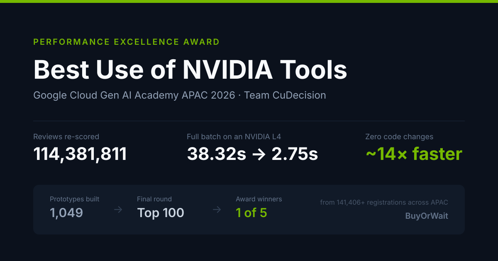
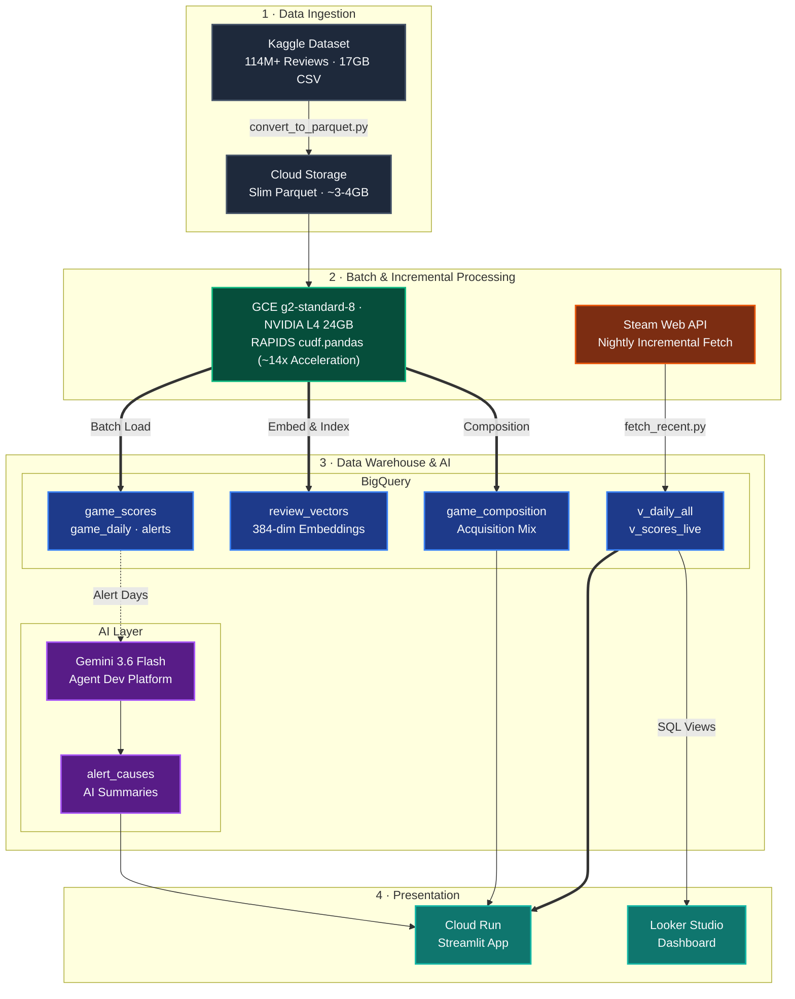
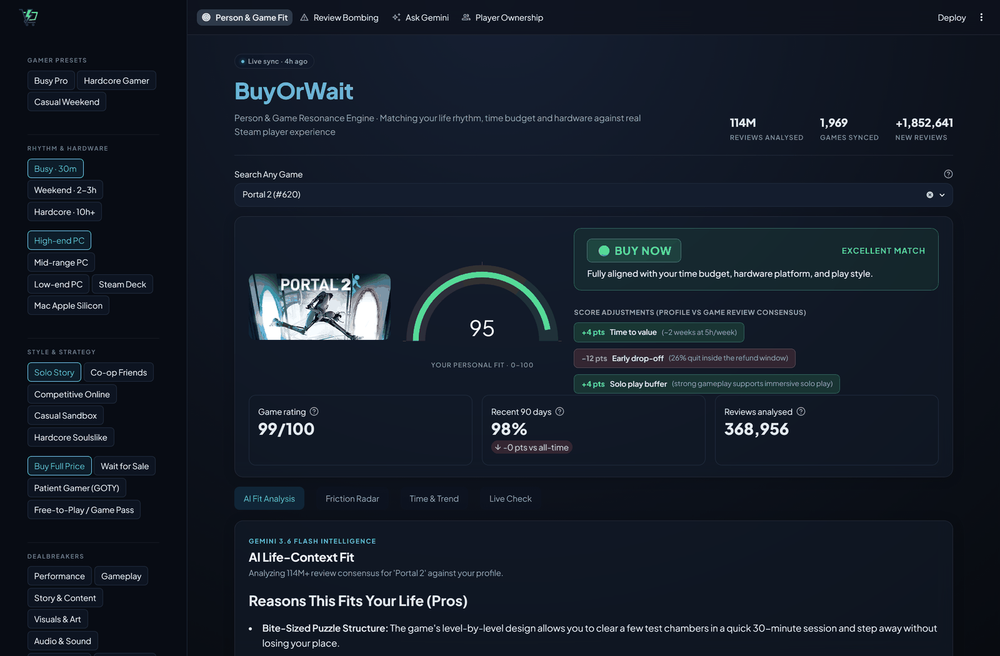
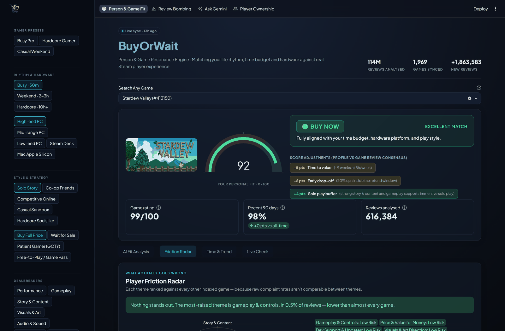
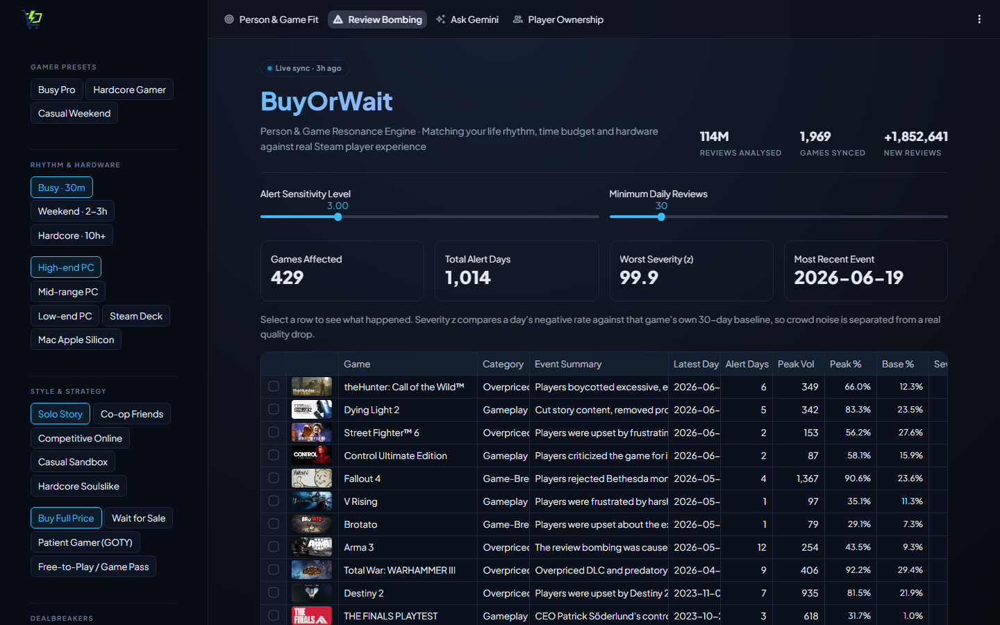
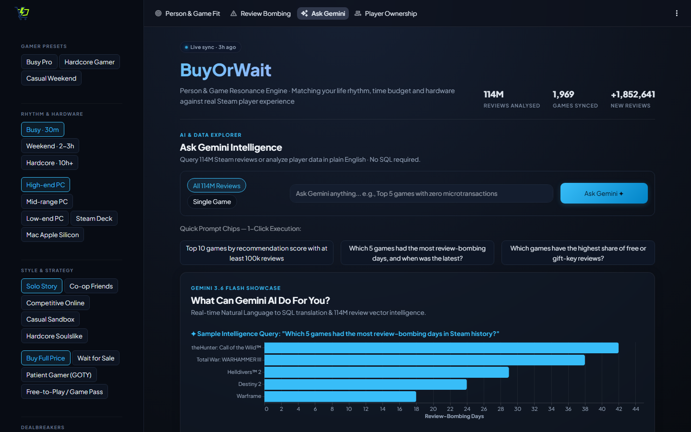
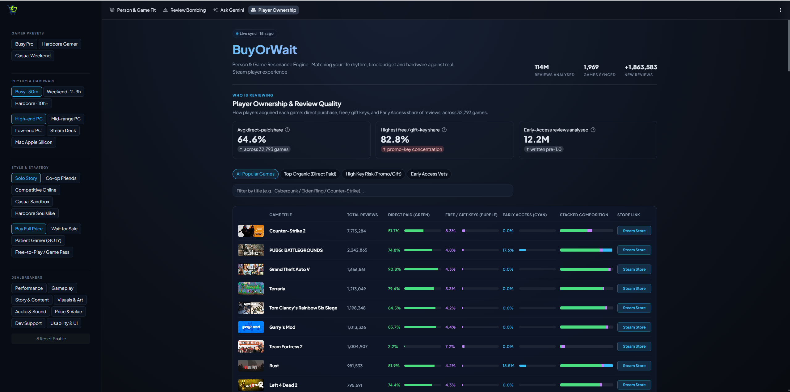
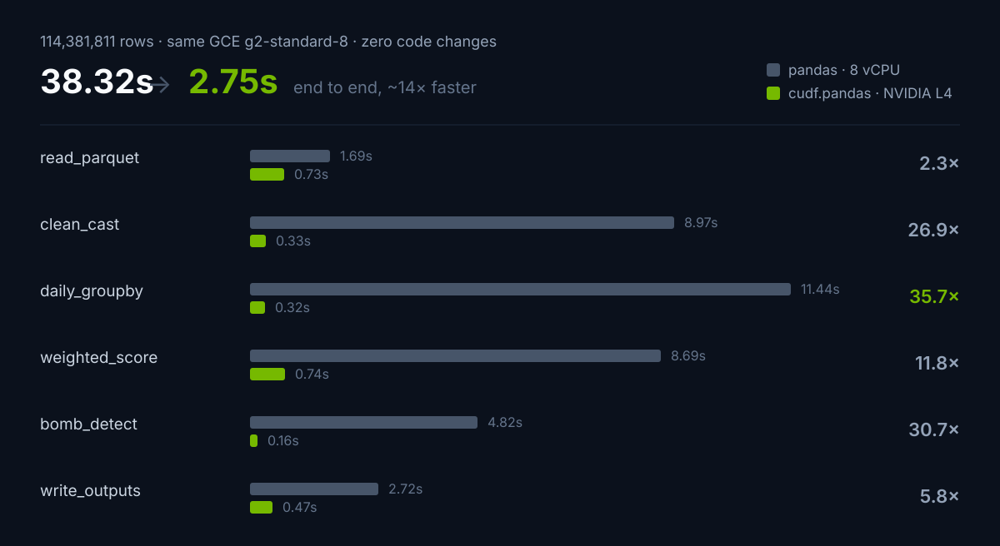

# BuyOrWait — To Buy or Not to Buy

> Steam sentiment intelligence powered by NVIDIA RAPIDS acceleration — the overall rating tells you whether a game is good, not whether it is good *for you*.



[](#)
[](#)
[](#benchmarks)
[](#benchmarks)

One of five award-winning projects out of **1,049 prototypes** built during the Academy,
from 141,406+ registrations across Asia Pacific.

**[Live Demo](https://buyorwait-1047454501331.asia-southeast1.run.app)** | **[Demo Video (≤3 min)](https://youtu.be/gSyqp_9bQL0)** | **[Looker Studio Dashboard](https://datastudio.google.com/reporting/46e5a8c2-ce33-4179-a456-5d68db932760)**

---

## The Problem

For gamers in the Steam Community, evaluating a game based solely on Steam's "Overall Rating" label (e.g. "Very Positive") leaves three major blind spots for community members making purchase decisions:

1. **Stale signal** — it blends years-old reviews with today's. A game that was broken at launch and later fixed, or one that was great but recently review-bombed, looks the same.
2. **No personalisation** — it says nothing about whether the game fits *your* weekly schedule, hardware, or play style. A 200-hour RPG and a 4-hour indie both show "Very Positive".
3. **Hidden friction** — performance issues, bad ports, or predatory monetisation are buried inside thousands of text reviews that nobody reads in full.

A game sitting at "Very Positive" in the Steam Community can still be the wrong game for an individual player.

## What BuyOrWait Does

BuyOrWait is a purchase-decision tool built on **114M+ Steam reviews**. It computes a time-decayed score, personalises it to your profile, detects review-bombing anomalies, and lets you ask questions over the data in plain English — all GPU-accelerated with zero code changes.

The entire batch pipeline runs unchanged on CPU (`pandas`) and GPU (`cudf.pandas` on an NVIDIA L4): **~14x faster end-to-end (38.3s → 2.7s)** — turning bombing alerts from a daily batch into an hourly refresh.

## Features

**Purchase Confidence Score** — How good the game is *in general*. A playtime-weighted, 90-day half-life score that filters drive-by review noise and makes recent sentiment dominate.

**Personal Fit Score** — How good the game is *for you*. Adjusts the confidence score against your weekly time budget, hardware, and play style. Lands on Buy / Wait for Sale / Skip, with every adjustment shown so you can audit it. Game quality and personal fit are always shown as separate numbers — "great game, wrong game for you" stays visible.

**Bombing Alerts** — Rolling z-score anomaly detection (>3σ AND >2× volume) flags review-bombing events. Gemini reads the reviews from alert days and writes a cause summary.

**Friction Radar** — Eight quality dimensions (Performance, Gameplay, Story, Visuals, Audio, Price, Dev Support, Usability) scored by semantic search over negative reviews, then graded against each dimension's own distribution across every indexed game.

**Ask Gemini** — Natural-language questions over both the aggregated tables (SQL generation) and the raw review text (RAG via BigQuery vector search).

**Player Ownership** — Acquisition-method breakdown (purchased, free key, Early Access, etc.) for each game's reviewer base.

## Tech Stack

| Layer | Technology |
|---|---|
| GPU Acceleration | NVIDIA RAPIDS `cudf.pandas`, GCE g2-standard-8 (L4 24GB) |
| Data Warehouse | Google BigQuery (incl. vector search for 384-dim embeddings) |
| AI / LLM | Google Agent Development Platform / Gemini 3.6 Flash (cause attribution, NL query, RAG) |
| App & Hosting | Streamlit on Cloud Run |
| Analytics | Looker Studio |
| Storage | Google Cloud Storage (Parquet) |
| CI/CD | Cloud Build (CodeMender security audit + container build) |

## Architecture



The app queries only aggregated tables and one game's vectors at a time — never the 114M-row raw data.

## Screenshots

<details open>
<summary><strong>Person & Game Fit</strong> — your profile against the game's review consensus, with every score adjustment itemised</summary>



</details>

<details>
<summary><strong>Friction Radar</strong> — eight quality dimensions, each ranked against every other indexed game</summary>



</details>

<details>
<summary><strong>Review Bombing</strong> — z-score alerts with Gemini cause summaries; select a row to chart the event</summary>



</details>

<details>
<summary><strong>Ask Gemini</strong> — plain English over the data, or over the review text itself</summary>



</details>

<details>
<summary><strong>Player Ownership</strong> — how each game's reviewers actually acquired it</summary>



</details>

## Benchmarks

Same GCE `g2-standard-8` instance, dual run over **114,381,811 rows**: 8 vCPUs (`pandas`) vs NVIDIA L4 (`cudf.pandas`), **zero code changes**. Raw timings: [benchmarks/benchmark_results.csv](benchmarks/benchmark_results.csv).



| Phase | pandas (CPU) | cudf.pandas (GPU) | Speedup | Time Saved |
| :--- | ---: | ---: | ---: | ---: |
| `read_parquet` | 1.69s | 0.73s | 2.3x | 57% |
| `clean_cast` | 8.97s | 0.33s | 26.9x | 96% |
| `daily_groupby` | 11.44s | 0.32s | 35.7x | 97% |
| `weighted_score` | 8.69s | 0.74s | 11.8x | 91% |
| `bomb_detect` | 4.82s | 0.16s | 30.7x | 97% |
| `write_outputs` | 2.72s | 0.47s | 5.8x | 83% |
| **`end_to_end`** | **38.32s** | **2.75s** | **14.0x** | **93%** |

> Hardware: GCE g2-standard-8 (8 vCPUs / 32GB RAM / NVIDIA L4 24GB), Ubuntu 24.04 Deep Learning Image, CUDA 12.x.


### How this number was actually earned

The first GPU run was **slower** than the CPU baseline. Two operations were silently
falling back to host memory and dragging 114M rows across the bus each time:
review age computed as a `timedelta` (`.dt.days`), and a second `groupby` + `merge`
for the recent-window stats. End-to-end timing hid this — the win in one stage was
paying for the loss in another.

Timing every stage separately exposed it. Replacing the timedelta with an integer
day index and fusing the two aggregations into one pass is where most of the 14x
came from. The other prerequisite: **RMM's pool allocator has to be initialised
before pandas is imported**, or cuDF and the default allocator fight over the same
memory and the process corrupts its own heap.

The lesson is the reason this table exists at all: a GPU does not make code fast.
Measuring per stage — and finding where the GPU *isn't being used* — does.


## Metric Definitions

### Purchase Confidence Score

How good the game is *in general*.

```
score = Σ(wᵢ · voteᵢ) / Σ(wᵢ) × 100
where wᵢ = log(1 + playtime_at_review) × exp(−age_days / 90)
```

`playtime_at_review` weighting filters out drive-by review noise; the 90-day half-life (`HALF_LIFE_DAYS = 90`) makes recent sentiment dominate. The score is computed in [`pipeline.py`](pipeline/pipeline.py) at batch time.

### Personal Fit Score

How good the game is *for you*. The Purchase Confidence Score is the starting point, then the sidebar profile applies adjustments computed from real data:

- **Time-to-value** — median hours to enjoyment ÷ your weekly budget (>20 weeks: −25, >10: −14, >4: −5, ≤4: +4)
- **Early drop-off** — share quitting inside Steam's 2-hour refund window, weighted harder for "Busy" rhythm players
- **Hardware** — maps your device to the Performance & Optimization radar dimension (Low-end PC: High Risk −22, Moderate −9)
- **Goal** — decompression goal penalised if Gameplay & Controls shows risk
- **Play style** — Competitive players penalised on Performance and Dev Support risk; Solo players get a buffer when Story and Gameplay are clean
- **Purchase strategy** — "Wait for Sale" with high refund rate triggers additional penalty

Any selected dealbreaker sitting at High Risk caps the result at 35 (`FIT_DEALBREAKER_CAP`). Every adjustment is rendered next to the verdict with its reason — the weights are transparent judgement calls, not fitted parameters. Game quality and personal fit are always shown as **separate numbers**, so "great game, wrong game for you" stays visible.

### Friction Radar

Eight dimensions scored by semantic search over the game's negative reviews (with praise discount), then graded **against each dimension's own distribution across every indexed game**:

| Dimension | Probes for |
|---|---|
| Performance & Optimization | fps drops, stuttering, crashes, poor optimization |
| Gameplay & Controls | clunky controls, bad mechanics, frustrating gameplay |
| Story & Content Volume | short content, bad writing, boring plot |
| Visuals & Art Direction | ugly graphics, outdated visuals |
| Audio & Sound Quality | bad voice acting, terrible music, bugged sound |
| Price & Value for Money | overpriced, microtransactions, cash grab |
| Dev Support & Updates | abandoned, no updates, broken promises |
| Usability & Onboarding | confusing UI, steep learning curve, bad tutorial |

A dimension is **High Risk** at ≥ 90th percentile **and** ≥ 1% of the game's reviews; **Moderate Risk** at ≥ 70th percentile **and** ≥ 0.5%. The floor condition stops a rare theme from flagging on noise.

### Bombing Alert

Daily negative-review-rate z-score vs the 30-day rolling baseline (`ROLL = 30`) > 3 **and** daily review count > 2× the 30-day rolling average. A minimum of 7 days of history (`MIN_HIST = 7`) is required before detection activates. Dual conditions avoid false positives on small samples. Causes are summarised by Gemini from the reviews on the alert days.

### Data Window

The Kaggle snapshot contains reviews **through 2023-10-30**, topped up nightly for the top ~2k most-reviewed games (`TOP_N = 2000`) via the Steam Web API. "Today" anchors to the newest review in the data, never the wall clock.

## Prerequisites

- Python 3.11+
- GCP project with BigQuery, Cloud Run, and Vertex AI APIs enabled
- Kaggle API key (for downloading the dataset)
- (Optional) NVIDIA GPU with RAPIDS `cudf.pandas` for GPU acceleration — CPU path works identically

## Reproduction

```bash
# 0. Data: Kaggle "100 Million+ Steam Reviews" (~17GB CSV, reviews through 2023-10-30)
#    https://www.kaggle.com/datasets/kieranpoc/steam-reviews
kaggle datasets download -d kieranpoc/steam-reviews -p ~/raw --unzip

# 1. Raw CSV -> Slim Parquet (drops review text, 17GB -> ~3-4GB)
#    First run prints column names; verify the COLS mapping,
#    uncomment convert() at the bottom, then rerun.
python pipeline/convert_to_parquet.py

# 2. Benchmarks — same machine, zero code change
python pipeline/pipeline.py cpu                    # pandas baseline
python -m cudf.pandas pipeline/pipeline.py gpu     # RAPIDS on L4
# No GPU at hand? Verify the CPU path on a subset in ~1 minute:
MAX_FILES=3 python pipeline/pipeline.py cpu

# 3. Load results into BigQuery
bq mk --location=asia-southeast1 -d steam_intel
bq load --source_format=PARQUET --replace steam_intel.game_daily  out_game_daily.parquet
bq load --source_format=PARQUET --replace steam_intel.game_scores out_game_scores.parquet
bq load --source_format=PARQUET --replace steam_intel.alerts      out_alerts.parquet
bq load --source_format=CSV --autodetect --replace steam_intel.benchmark_results benchmark_results.csv

# 4. Enrichment layers (each writes one BigQuery table; all optional but the app
#    degrades gracefully rather than breaking if one is missing)
python pipeline/embed_index.py     # review_vectors   — powers Friction Radar + Ask Gemini RAG
python pipeline/attribute.py       # alert_causes     — Gemini "why was it bombed"
python pipeline/composition.py     # game_composition — purchase / free-key / Early Access mix
python pipeline/fetch_recent.py    # daily_delta      — nightly Steam API top-up (run on a schedule)

# 5. BigQuery views/tables — evergreen first (alerts_live.sql reads v_daily_all)
bq query --use_legacy_sql=false < docs/evergreen.sql    # v_daily_all, v_scores_live, v_freshness
bq query --use_legacy_sql=false < docs/alerts_live.sql  # alerts_recent, v_alerts_all, alert_causes
# Schedule the first block of alerts_live.sql as a daily scheduled query (03:30 SGT,
# right after the nightly fetch) so post-snapshot bombing events keep being detected.

# 6. App (local)
cd app && pip install -r requirements.txt
GCP_PROJECT=your_project_id streamlit run app.py
# Ask Gemini: set GEMINI_API_KEY (Google AI Studio), or skip it and use
# Agent Development Platform on Cloud Run (step 7) with no key at all.

# 7. Deploy to Cloud Run (uses app/Dockerfile)
# One-time, for Gemini via Agent Development Platform (key-less):
#   gcloud services enable aiplatform.googleapis.com
#   + grant the Cloud Run service account roles/aiplatform.user
gcloud run deploy buyorwait --source app --region asia-southeast1 \
  --allow-unauthenticated --max-instances 2 \
  --set-env-vars GCP_PROJECT=your_project_id

# 8. Looker Studio dashboard (optional)
bq query --use_legacy_sql=false < docs/looker_views.sql
```

## CI/CD

[`cloudbuild.yaml`](cloudbuild.yaml) defines a Cloud Build pipeline with two stages:

1. **CodeMender Security Audit** — Sends pipeline code and team conventions (`.codemender/conventions.md`) to Agent Development Platform for automated SAST review against the project's coding standards (parameterized SQL, session reuse, timeout policies, output sanitization).
2. **Container Build & Push** — Builds the pipeline Docker image and pushes it to Artifact Registry.

## Repository Layout

```
buyorwait/
├── pipeline/                      Batch processing & enrichment
│   ├── pipeline.py                Timed CPU/GPU batch pipeline (the benchmark)
│   ├── convert_to_parquet.py      CSV -> slim Parquet
│   ├── embed_index.py             Review text -> embeddings -> BigQuery vectors
│   ├── attribute.py               Gemini cause attribution for bombing events
│   ├── composition.py             Reviewer-acquisition breakdown per game
│   ├── fetch_recent.py            Nightly Steam API incremental fetch
│   ├── Dockerfile                 Pipeline container for Cloud Run Jobs
│   └── requirements.txt
├── app/                           Streamlit application
│   ├── app.py                     Main app (Cloud Run)
│   ├── Dockerfile                 App container
│   ├── requirements.txt
│   ├── .streamlit/config.toml     Native dark theme
│   └── assets/                    Static assets
├── benchmarks/                    GPU acceleration evidence
│   ├── benchmark_results.csv      Raw timestamped CPU vs GPU timings
│   ├── nvidia-smi.png             GPU utilisation proof
│   └── README.md                  Hardware specs & methodology
├── docs/                          SQL, screenshots & walkthrough
│   ├── WALKTHROUGH.md             End-to-end system walkthrough + live demo script
│   ├── evergreen.sql              Daily merge views + evergreen score
│   ├── alerts_live.sql            Nightly alert recompute + unified alert view
│   ├── looker_views.sql           Looker Studio data views
│   ├── looker_studio.md           Dashboard setup guide
│   └── *.png                      App screenshots
├── .codemender/conventions.md     Team coding standards (fed to CI audit)
├── cloudbuild.yaml                Cloud Build CI/CD pipeline
└── LICENSE                        MIT
```

## Engineering Record

[docs/REFINEMENT_SPRINT.md](docs/REFINEMENT_SPRINT.md) — what changed in the final
refinement week and why: the evergreen-score design, the nightly ingestion loop, the
GPU benchmark that started out *slower* than CPU, and the features deliberately not
built (managed vector DB, GKE, streaming) with the reasoning for each.

## Walkthrough

[docs/WALKTHROUGH.md](docs/WALKTHROUGH.md) walks the whole system in execution order — data in,
GPU batch, the evergreen-score trick, each enrichment layer, orchestration, security posture, and every page of
the app.

## License

[MIT](LICENSE)

Data Source: Kaggle Steam Reviews (all sourced from public Steam APIs).
