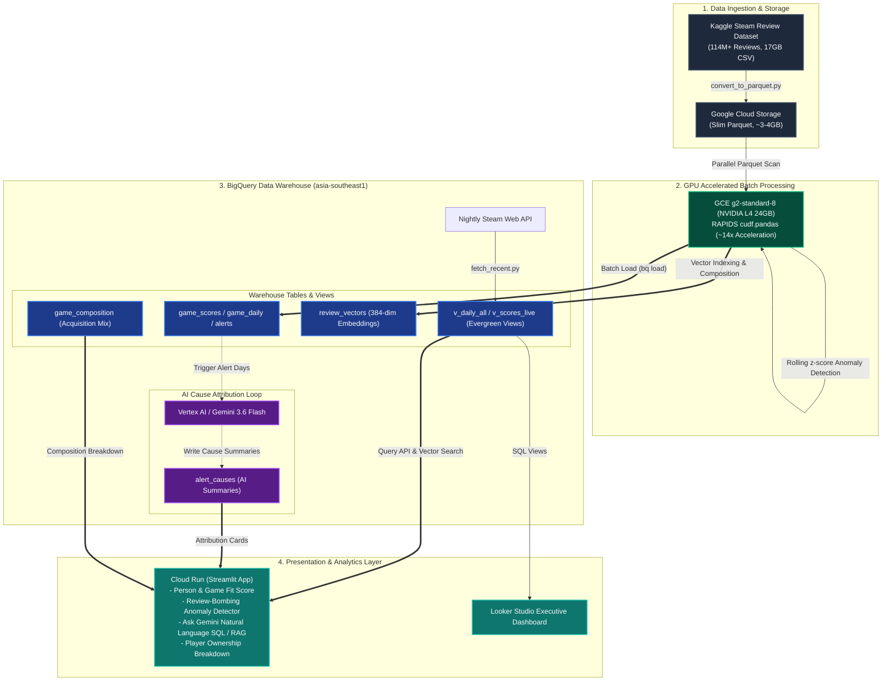

# BuyOrWait — To Buy or Not to Buy

> Steam sentiment intelligence powered by NVIDIA RAPIDS acceleration — the overall rating tells you whether a game is good, not whether it is good *for you*.

**Live Demo:** [buyorwait-1047454501331.asia-southeast1.run.app](https://buyorwait-1047454501331.asia-southeast1.run.app) · **Demo Video (≤3 min):** [Watch Video](https://youtu.be/gSyqp_9bQL0) · **Looker Studio:** [Interactive Dashboard](https://datastudio.google.com/reporting/46e5a8c2-ce33-4179-a456-5d68db932760)

BuyOrWait is a purchase-decision tool built on **114M+ Steam reviews**. Steam's overall rating blends years-old sentiment with today's, hides games that have since been fixed or review-bombed, and says nothing about whether a game suits *your* schedule, hardware or taste. BuyOrWait computes a playtime-weighted, 90-day half-life **Purchase Confidence Score**, then adjusts it into a **Personal Fit Score** against your life rhythm, weekly time budget, hardware and play style — landing on Buy / Wait for Sale / Skip with every adjustment shown so you can audit it. It raises **Bombing Alerts** via rolling z-score anomaly detection with Gemini-written cause summaries, ranks eight quality dimensions against the whole corpus in a **Friction Radar**, and answers plain-English questions over both the aggregated tables and the raw review text.

The entire batch pipeline runs unchanged on CPU (pandas) and GPU (`cudf.pandas` on an NVIDIA L4): **~14x faster end-to-end (38.3s → 2.7s)** — turning bombing alerts from a daily batch into an hourly refresh. Stack: Cloud Storage + BigQuery (incl. vector search) + Cloud Run (Streamlit) + Gemini (Vertex AI) + Looker Studio + NVIDIA RAPIDS.

## Architecture



The app queries only aggregated tables and one game's vectors at a time — never the 114M-row raw data.

## Screenshots

**Person & Game Fit** — your profile against the game's review consensus, with every score adjustment itemised:


**Friction Radar** — eight quality dimensions, each ranked against every other indexed game:


**Review Bombing** — z-score alerts with Gemini cause summaries; select a row to chart the event:


**Ask Gemini** — plain English over the data, or over the review text itself:


**Player Ownership** — how each game's reviewers actually acquired it:


## Benchmarks

Same GCE `g2-standard-8` instance, dual run over **114,381,811 rows**: 8 vCPUs (`pandas`) vs NVIDIA L4 (`cudf.pandas`), **zero code changes**. Raw timings: [benchmarks/benchmark_results.csv](benchmarks/benchmark_results.csv).

| Phase | pandas (CPU) | cudf.pandas (L4) | Speedup |
|---|---|---|---|
| read_parquet | 1.69s | 0.73s | 2.3x |
| clean_cast | 8.97s | 0.33s | 26.9x |
| daily_groupby | 11.44s | 0.32s | 35.7x |
| weighted_score | 8.69s | 0.74s | 11.8x |
| bomb_detect | 4.82s | 0.16s | 30.7x |
| write_outputs | 2.72s | 0.47s | 5.8x |
| **end_to_end** | **38.32s** | **2.75s** | **~14x** |

Hardware: GCE g2-standard-8 (8 vCPUs / 32GB RAM / NVIDIA L4 24GB), Ubuntu 24.04 Deep Learning Image, CUDA 12.x.


## Metric Definitions

- **Purchase Confidence Score** — how good the game is *in general*: `score = Σ(wᵢ·voteᵢ)/Σ(wᵢ) × 100` where `wᵢ = log(1+playtime_at_review) × exp(−age_days/90)`. Playtime weighting filters out drive-by review noise; the 90-day half-life makes recent sentiment dominate.
- **Personal Fit Score** — how good the game is *for you*. The Purchase Confidence Score is the starting point, then the sidebar profile applies adjustments computed from real data: time-to-value (median hours to enjoyment ÷ your weekly budget), early drop-off (share quitting inside the refund window, weighted harder for short-session players), hardware, and play style. Any selected dealbreaker sitting at High Risk caps the result at 35. Every adjustment is rendered next to the verdict with its reason — the weights are transparent judgement calls, not fitted parameters. Game quality and personal fit are always shown as **separate numbers**, so "great game, wrong game for you" stays visible.
- **Friction Radar** — eight dimensions (Performance, Gameplay, Story & Content, Visuals, Audio, Price & Value, Dev Support, Usability) scored by semantic search over the game's negative reviews, then graded **against each dimension's own distribution across every indexed game**. This matters: measured over the corpus, some themes draw complaints in two thirds of all games and others in under 5%, so a single flat threshold grades every game identically. A dimension is High Risk at ≥ 90th percentile **and** ≥ 1% of the game's reviews — the floor stops a rare theme flagging on noise.
- **Bombing Alert** — daily negative-review-rate z-score vs the 30-day rolling baseline > 3 **and** daily review count > 2× the 30-day rolling average (dual conditions avoid false positives on small samples). Causes are summarised by Gemini from the reviews on the alert days.
- **Data window** — the Kaggle snapshot contains reviews **through 2023-10-30**, topped up nightly for ~1.9k games via the Steam Web API. "Today" anchors to the newest review in the data, never the wall clock.

## Reproduction

```bash
# 0. Data: Kaggle "100 Million+ Steam Reviews" (~17GB CSV, reviews through 2023-10-30)
#    https://www.kaggle.com/datasets/kieranpoc/steam-reviews
kaggle datasets download -d kieranpoc/steam-reviews -p ~/raw --unzip

# 1. Raw CSV -> Slim Parquet (drops review text, 17GB -> ~3-4GB)
#    First run prints column names; verify the COLS mapping,
#    uncomment convert() at the bottom, then rerun.
python pipeline/convert_to_parquet.py

# 2. Benchmarks — same machine, zero code change
python pipeline/pipeline.py cpu                    # pandas baseline
python -m cudf.pandas pipeline/pipeline.py gpu     # RAPIDS on L4
# No GPU at hand? Verify the CPU path on a subset in ~1 minute:
MAX_FILES=3 python pipeline/pipeline.py cpu

# 3. Load results into BigQuery
bq mk --location=asia-southeast1 -d steam_intel
bq load --source_format=PARQUET --replace steam_intel.game_daily  out_game_daily.parquet
bq load --source_format=PARQUET --replace steam_intel.game_scores out_game_scores.parquet
bq load --source_format=PARQUET --replace steam_intel.alerts      out_alerts.parquet
bq load --source_format=CSV --autodetect --replace steam_intel.benchmark_results benchmark_results.csv

# 4. Enrichment layers (each writes one BigQuery table; all optional but the app
#    degrades gracefully rather than breaking if one is missing)
python pipeline/embed_index.py     # review_vectors   — powers Friction Radar + Ask Gemini RAG
python pipeline/attribute.py       # alert_causes     — Gemini "why was it bombed"
python pipeline/composition.py     # game_composition — purchase / free-key / Early Access mix
python pipeline/fetch_recent.py    # daily_delta      — nightly Steam API top-up (run on a schedule)

# 5. BigQuery views/tables — evergreen first (alerts_live.sql reads v_daily_all)
bq query --use_legacy_sql=false < docs/evergreen.sql    # v_daily_all, v_scores_live, v_freshness
bq query --use_legacy_sql=false < docs/alerts_live.sql  # alerts_recent, v_alerts_all, alert_causes
# Schedule the first block of alerts_live.sql as a daily scheduled query (03:30 SGT,
# right after the nightly fetch) so post-snapshot bombing events keep being detected.

# 6. App (local)
cd app && pip install -r requirements.txt
GCP_PROJECT=your_project_id streamlit run app.py
# Ask Gemini: set GEMINI_API_KEY (Google AI Studio), or skip it and use
# Vertex AI on Cloud Run (step 7) with no key at all.

# 7. Deploy to Cloud Run (uses app/Dockerfile)
# One-time, for Gemini via Vertex AI (key-less):
#   gcloud services enable aiplatform.googleapis.com
#   + grant the Cloud Run service account roles/aiplatform.user
gcloud run deploy buyorwait --source app --region asia-southeast1 \
  --allow-unauthenticated --max-instances 2 \
  --set-env-vars GCP_PROJECT=your_project_id

# 8. Looker Studio dashboard (optional)
bq query --use_legacy_sql=false < docs/looker_views.sql
```

## Repository Layout

```
pipeline/     convert_to_parquet.py  CSV -> slim Parquet
              pipeline.py            timed CPU/GPU batch pipeline (the benchmark)
              embed_index.py         review text -> embeddings -> BigQuery vectors
              attribute.py           Gemini cause attribution for bombing events
              composition.py         reviewer-acquisition breakdown per game
              fetch_recent.py        nightly Steam API incremental fetch
app/          app.py, Dockerfile (Cloud Run), .streamlit/config.toml (native theme), assets/
benchmarks/   benchmark_results.csv, nvidia-smi.png, hardware details
docs/         WALKTHROUGH.md        end-to-end system walkthrough + live demo script
              evergreen.sql         daily merge views + evergreen score + alignment check
              alerts_live.sql       nightly alert recompute, unified alert view, causes table
              looker_views.sql, looker_studio.md, app screenshots
```

## Walkthrough

[docs/WALKTHROUGH.md](docs/WALKTHROUGH.md) walks the whole system in execution order — data in,
GPU batch, the evergreen-score trick, each enrichment layer, orchestration, and every page of
the app — then doubles as the live demo script (click path, narration, and the answers to the
questions this design invites).

## License

[MIT](LICENSE)

Data Source: Kaggle Steam Reviews (all sourced from public Steam APIs).
